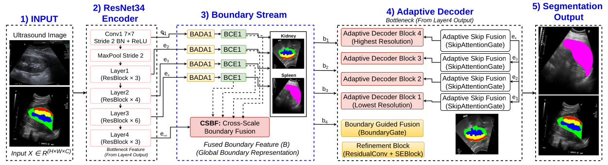
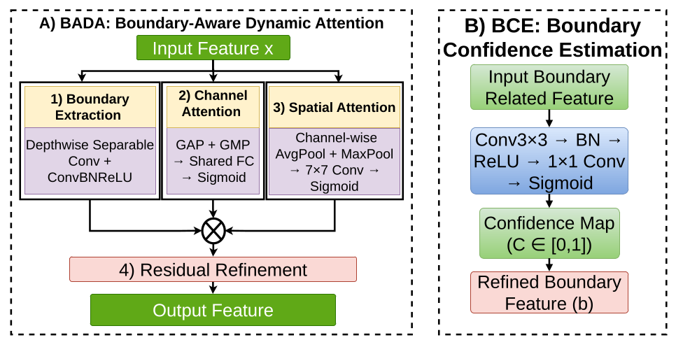
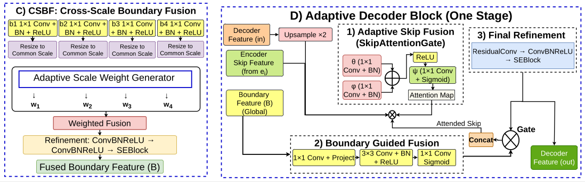

# BADF-Net: Boundary-Aware Dynamic Fusion Network

**A Method for Enhancing Abdominal Ultrasound Diagnosis via Boundary-Aware Dynamic Fusion Network-Based Multi-Anatomical Structure Segmentation**

[](https://doi.org/10.3390/1010000)
[](https://creativecommons.org/licenses/by/4.0/)
[](https://www.python.org/)
[](https://pytorch.org/)

BADF-Net integrates a **Boundary-Aware Dynamic Attention (BADA)** module with **Boundary Confidence Estimation (BCE)** at every stage of a squeeze-and-excitation (SE) recalibrated ResNet-34 encoder, a **Cross-Scale Boundary Fusion (CSBF)** module that adaptively combines multi-scale boundary cues, and a boundary-guided decoder with attention-gated skip fusion — jointly targeting weak boundaries, speckle noise, and visually similar tissue appearances in abdominal ultrasound segmentation.

---

## Table of Contents

- [Overview](#overview)
- [Architecture](#architecture)
- [Repository Contents](#repository-contents)
- [Key Results](#key-results)
- [Dataset](#dataset)
- [Installation](#installation)
- [Usage](#usage)
- [Hyperparameters](#hyperparameters)
- [Ablation Studies](#ablation-studies)
- [Authors & Affiliations](#authors--affiliations)
- [Citation](#citation)
- [License](#license)
- [Acknowledgments](#acknowledgments)
- [Contact](#contact)

---

## Overview

| Item | Description |
|---|---|
| **Task** | Multi-anatomical structure (MAS) segmentation in abdominal ultrasound |
| **Anatomical structures** | Kidney (capsule, central echo complex, medulla, cortex) and spleen — 6 classes including background |
| **Core idea** | Dynamic boundary attention + channel recalibration + adaptive cross-scale boundary fusion |
| **Backbone** | ImageNet-pretrained ResNet-34 |
| **Best result** | Dice 0.8174, Pixel Accuracy 0.9703, HD95 11.49, inference 0.016 s/image |
| **Baselines compared** | 11 (Att-UNet, CMUNeXt, UDBA-UNet, UNet, UNet++, ResUNet++, UDBRNet, Residual U-Net, MultiResUNet, MISSFormer, EMCAD) |

---

## Architecture

The overall framework consists of five principal components: (i) an ImageNet-pretrained ResNet-34 encoder, (ii) BADA followed by BCE at four encoder levels, (iii) Cross-Scale Boundary Fusion (CSBF), (iv) a four-stage adaptive boundary-guided decoder, and (v) a segmentation head with full-resolution interpolation.

<p align="center">
  
  <br>
  <em>Figure 1. Overview of the proposed BADF-Net architecture. A ResNet-34 encoder produces skip features e1–e4, each refined by a BADA–BCE module and aggregated by Cross-Scale Boundary Fusion (CSBF) into a shared boundary feature B, which guides a four-stage adaptive decoder to produce the final segmentation.</em>
</p>

<p align="center">
  
  <br>
  <em>Figure 2. Internal structure of the boundary-refinement modules — (A) BADA fuses boundary-extraction, channel-attention, and spatial-attention branches, followed by residual refinement; (B) BCE converts the BADA output into a per-pixel confidence map.</em>
</p>

<p align="center">
  
  <br>
  <em>Figure 3. Internal structure of the fusion and decoding modules — (C) CSBF projects, resizes, and adaptively weights the four BCE outputs into a fused boundary feature B; (D) each adaptive decoder block applies attention-gated skip fusion, boundary-guided gating, and residual refinement.</em>
</p>

> **Note:** Place the corresponding figure images (exported from the paper) under `Architecture/` using the filenames referenced above for them to render correctly.

### Component-to-Limitation Mapping

| Component | Mechanism | Limitation Addressed |
|---|---|---|
| SE channel recalibration (encoder) | Rescales channel activations via global context, per residual block | Tissue class confusion |
| BADA module | Fuses standard + dilated conv branches into a sigmoid-gated attention map | Boundary loss; background leakage |
| Boundary Confidence Estimation (BCE) | Weights BADA-refined features by a learned per-pixel confidence map | Boundary loss |
| Cross-Scale Boundary Fusion (CSBF) | Adaptively weights and fuses BCE outputs across four encoder scales | Robustness across conditions |
| Dice–Focal loss | Weighted overlap + hard-example-focused loss (0.5/0.5) | Class imbalance |

---

## Repository Contents

### Directory Structure

```
BADF_Net/
│
├── Architecture/                     # Architecture diagrams / figures used in the paper and README
│
├── Kidney_dataset/                   # Kidney ultrasound dataset (capsule, CEC, medulla, cortex labels)
│
├── ablation_results/                 # Outputs of the ablation studies
│   ├── Architectural_Ablation_Results
│   └── Loss_Ablation_Results
│
├── checkpoints/                      # All trained model weights and corresponding results
│
├── network/                          # Core model architecture
│   ├── BADF-Net.py                   # Full BADF-Net implementation (BADA, BCE, CSBF, decoder)
│   └── BADF-Net_Ablation.py          # Configurable variant used for architectural ablation runs
│
├── Att-UNet_Test_Results.py          # Evaluation script for the Att-UNet baseline
├── dataloader.py                     # Dataset loading and preprocessing (merged kidney + spleen set)
├── losses_ablation.py                # Loss-function variants used in the loss ablation study
├── run_architecture_ablation.py      # Driver script for the architectural ablation study
├── run_loss_ablation.py              # Driver script for the loss-function ablation study
├── test.py                           # Main evaluation script (Dice, HD95, ASD, PA, MPA, Precision, Recall, F1)
├── test-1.py                         # Additional/variant evaluation script
├── test-2.py                         # Additional/variant evaluation script
└── train.py                          # Training entry point
```

### File & Directory Reference

| Path | Description |
|---|---|
| `Architecture/` | Architecture diagrams (encoder, BADA/BCE, CSBF/decoder) referenced in this README |
| `Kidney_dataset/` | Kidney ultrasound dataset used for the merged multi-anatomical (MAS) dataset |
| `ablation_results/Architectural_Ablation_Results` | Results from removing/replacing individual architectural components (Table 8) |
| `ablation_results/Loss_Ablation_Results` | Results from comparing loss-function formulations (Table 9) |
| `checkpoints/` | All trained model weights and their associated evaluation results |
| `network/BADF-Net.py` | Full BADF-Net architecture — ResNet-34 encoder, BADA, BCE, CSBF, adaptive decoder |
| `network/BADF-Net_Ablation.py` | Ablation-configurable version of BADF-Net used to toggle individual components |
| `Att-UNet_Test_Results.py` | Test/evaluation script for the Att-UNet baseline comparison |
| `dataloader.py` | Dataset loader for the merged kidney + spleen ultrasound dataset |
| `losses_ablation.py` | Alternative loss formulations (Dice-only, Focal-only, Tversky, CE, composites) for ablation |
| `run_architecture_ablation.py` | Runs the full architectural ablation sweep |
| `run_loss_ablation.py` | Runs the full loss-function ablation sweep |
| `test.py` | Main evaluation script — computes Dice, HD95, ASD, inference time, PA, MPA, Precision, Recall, F1 |
| `test-1.py`, `test-2.py` | Supplementary evaluation scripts (e.g., baseline comparisons, alternate metric configurations) |
| `train.py` | Training entry point for BADF-Net |
| `README.md` | This file |

---

## Key Results

### Overall Comparison (Table 6 in paper)

| Method | Dice ↑ | HD95 ↓ | ASD ↓ | Time (s) ↓ | PA ↑ | MPA ↑ | Precision ↑ | Recall ↑ | F1 ↑ |
|---|---|---|---|---|---|---|---|---|---|
| Att-UNet | 0.7049 | 12.02 | 2.63 | 0.053 | 0.9688 | 0.7514 | 0.7565 | 0.7514 | 0.7537 |
| CMUNeXt | 0.7005 | 12.61 | 2.49 | 0.031 | 0.9689 | 0.7546 | 0.7489 | 0.7546 | 0.7477 |
| UDBA-UNet | 0.6991 | 14.50 | 3.04 | 0.032 | 0.9674 | 0.7436 | 0.7383 | 0.7436 | 0.7368 |
| UNet | 0.6953 | 13.80 | 2.98 | 0.030 | 0.9673 | 0.7407 | 0.7454 | 0.7407 | 0.7403 |
| UNet++ | 0.6927 | 15.51 | 3.46 | 0.042 | 0.9665 | 0.7261 | 0.7490 | 0.7261 | 0.7354 |
| ResUNet++ | 0.6924 | 11.98 | 2.63 | 0.029 | 0.9665 | 0.7240 | 0.7451 | 0.7240 | 0.7327 |
| UDBRNet | 0.6017 | 13.18 | 3.11 | 0.040 | 0.9590 | 0.6923 | 0.7104 | 0.6923 | 0.6976 |
| Residual U-Net | 0.5731 | 15.95 | 3.89 | 0.048 | 0.9571 | 0.6470 | 0.7299 | 0.6470 | 0.6846 |
| MultiResUNet | 0.4761 | 26.27 | 10.04 | 0.036 | 0.7892 | 0.5369 | 0.5375 | 0.5669 | 0.5603 |
| MISSFormer | 0.7028 | 13.02 | 2.61 | 0.047 | 0.9589 | 0.6922 | 0.7103 | 0.6922 | 0.6976 |
| EMCAD | 0.6170 | 13.15 | 3.09 | 0.030 | 0.9492 | 0.6368 | 0.6344 | 0.6368 | 0.6302 |
| **BADF-Net (Proposed)** | **0.8174** | **11.49** | 2.51 | **0.016** | **0.9703** | **0.8521** | **0.7744** | **0.7759** | **0.7741** |

### Per-Tissue Dice Score (Table 7 in paper)

| Method | Capsule ↑ | Central Echo Complex ↑ | Medulla ↑ | Cortex ↑ | Spleen ↑ | Average ↑ |
|---|---|---|---|---|---|---|
| Att-UNet | 0.6402 | 0.8077 | 0.5799 | 0.5351 | 0.9615 | 0.7049 |
| CMUNeXt | 0.6092 | 0.8161 | 0.5952 | 0.5131 | 0.9689 | 0.7005 |
| UNet | 0.6065 | 0.8063 | 0.6039 | 0.4983 | 0.9616 | 0.6953 |
| UDBA-UNet | 0.6109 | 0.8172 | 0.5999 | 0.4970 | 0.9706 | 0.6991 |
| UNet++ | 0.6194 | 0.7833 | 0.5836 | 0.5093 | 0.9679 | 0.6927 |
| ResUNet++ | 0.6145 | 0.8119 | 0.5849 | 0.4932 | 0.9574 | 0.6924 |
| UDBRNet | 0.5213 | 0.7124 | 0.5023 | 0.4515 | 0.8209 | 0.6017 |
| Residual U-Net | 0.5750 | 0.7173 | 0.5379 | 0.4990 | 0.5365 | 0.5731 |
| MultiResUNet | 0.3849 | 0.6374 | 0.4343 | 0.3056 | 0.6181 | 0.4761 |
| MISSFormer | 0.6522 | 0.7653 | 0.5773 | 0.5936 | 0.9258 | 0.7028 |
| EMCAD | 0.5711 | 0.7125 | 0.5376 | 0.4907 | 0.7729 | 0.6170 |
| **BADF-Net (Proposed)** | **0.7404** | **0.8405** | **0.7525** | **0.7751** | **0.9786** | **0.8174** |

### Independent Clinical Validation

| Metric | Value |
|---|---|
| Dice agreement with blinded radiologist annotations (50-case subset) | 0.78 |
| Predictions judged clinically acceptable for measurement | 88% |

---

## Dataset

| Source | Original Annotation | Unified Class ID |
|---|---|---|
| Kidney dataset | Background | 0 |
| Kidney dataset | Capsule | 1 |
| Kidney dataset | Central Echo Complex (CEC) | 2 |
| Kidney dataset | Medulla | 3 |
| Kidney dataset | Cortex | 4 |
| Spleen dataset | Background | 0 |
| Spleen dataset | Spleen | 5 |

| Tissue Type | Capsule | Central Echo Complex | Medulla | Cortex | Spleen |
|---|---|---|---|---|---|
| No. of images with label | 534 | 534 | 534 | 534 | 450 |

**Data sources:**

| Component | Link |
|---|---|
| Kidney ultrasound dataset | https://github.com/rsingla92/kidneyUS |
| Spleen ultrasound dataset | https://www.ariameditech.com/datasets/spleenex |
| Merged 6-class dataset & preprocessing scripts | Available from the corresponding author upon reasonable request |

Split strategy: **80% train / 10% validation / 10% test**, with patient-level separation where identifiers were available to prevent data leakage.

---

## Installation

```bash
# Clone the repository
git clone https://github.com/rashed200613/BADF-Net.git
cd BADF-Net

# Create environment
conda create -n badf-net python=3.9 -y
conda activate badf-net

# Install dependencies
pip install -r requirements.txt
```

**Suggested `requirements.txt` contents:**

| Package | Purpose |
|---|---|
| `torch`, `torchvision` | Model implementation and pretrained ResNet-34 |
| `numpy` | Numerical operations |
| `opencv-python` | Image I/O and preprocessing |
| `scikit-image` | Boundary/distance metrics (HD95, ASD) |
| `scikit-learn` | Metric utilities, confusion matrix |
| `pandas` | Results/CSV logging |
| `matplotlib`, `seaborn` | Plots (confusion matrix, box plots) |
| `tqdm` | Progress bars |
| `pyyaml` | Config file parsing |

---

## Usage

### Training

```bash
python train.py \
  --data_root Kidney_dataset/ \
  --epochs 200 \
  --batch_size 4 \
  --lr 1e-4
```

`train.py` uses the `BADF_Net` architecture defined in `network/BADF-Net.py` together with `dataloader.py` for data loading, and optimizes the composite Dice–Focal loss (see [Hyperparameters](#hyperparameters)).

### Evaluation

```bash
python test.py \
  --checkpoint checkpoints/badf_net_best.pth \
  --data_root Kidney_dataset/ \
  --output_csv ablation_results/badf_net_metrics.csv
```

Outputs Dice Score, HD95, ASD, inference time, loss, Pixel Accuracy, Mean Pixel Accuracy, Precision, Recall, and F1-Score, plus a per-class confusion matrix. `test-1.py` and `test-2.py` provide supplementary evaluation configurations, and `Att-UNet_Test_Results.py` runs the equivalent evaluation for the Att-UNet baseline.

### Architectural Ablation

```bash
python run_architecture_ablation.py \
  --config network/BADF-Net_Ablation.py \
  --data_root Kidney_dataset/ \
  --output_dir ablation_results/Architectural_Ablation_Results
```

### Loss-Function Ablation

```bash
python run_loss_ablation.py \
  --losses losses_ablation.py \
  --data_root Kidney_dataset/ \
  --output_dir ablation_results/Loss_Ablation_Results
```

---

## Hyperparameters

| Hyperparameter | Value |
|---|---|
| Input image size | 256 × 256 |
| Number of classes | 6 |
| Batch size | 4 |
| Optimizer | AdamW |
| Initial learning rate | 1 × 10⁻⁴ |
| Weight decay | 1 × 10⁻⁴ |
| Maximum epochs | 200 |
| Loss function | Composite (0.5 × Dice + 0.5 × Focal) |
| Focal loss α | 0.25 |
| Focal loss γ | 2.0 |
| Dice smoothing factor | 1.0 |
| Data augmentation | Random rotation, horizontal flip, intensity scaling |
| Random seed | 42 |
| Hardware used in paper | NVIDIA GeForce RTX 4090 (24 GB, CUDA) |

---

## Ablation Studies

### Architectural Ablation (Table 8 in paper)

| Group | Variant | Dice ↑ | Δ |
|---|---|---|---|
| Conf./Boundary fusion | Remove decoder Boundary Gate | 0.7530 | −0.0644 |
| Conf./Boundary fusion | Remove Boundary Confidence Estimation (BCE) | 0.7533 | −0.0641 |
| Conf./Boundary fusion | CSBF replaced with concat + 1×1 conv | 0.7725 | −0.0449 |
| Conf./Boundary fusion | CSBF with fixed equal scale weights | 0.7870 | −0.0304 |
| BADA (internal) | BADA: no channel/spatial attention | 0.7635 | −0.0539 |
| BADA (internal) | Boundary extraction: standard conv (no DW-sep) | 0.7653 | −0.0521 |
| BADA (internal) | Removed BADA entirely | 0.7683 | −0.0491 |
| BADA (internal) | BADA: channel attention only | 0.7752 | −0.0422 |
| BADA (internal) | Skip fusion: plain concat (no attention gate) | 0.7806 | −0.0368 |
| BADA (internal) | BADA: spatial attention only | 0.7853 | −0.0321 |
| Backbone/encoder | Lighter backbone: ResNet18 instead of ResNet34 | 0.7636 | −0.0538 |
| Backbone/encoder | Remove all SE blocks | 0.7885 | −0.0289 |
| Decoder | Remove residual refinement in decoder | 0.7815 | −0.0359 |
| — | **Full BADF-Net (proposed)** | **0.8174** | — |

### Loss Function Ablation (Table 9 in paper)

| Description | Test Dice (Overall) |
|---|---|
| 0.5 Dice + 0.3 Focal + 0.2 Tversky | 0.7792 |
| Dice only | 0.7571 |
| Focal only | 0.7868 |
| Tversky only (α=0.7, β=0.3) | 0.7525 |
| Standard Cross-Entropy only | 0.7898 |
| Dice + CE (0.5/0.5) | 0.7836 |
| Dice + Tversky (0.5/0.5), Focal dropped | 0.7411 |
| Composite with equal weights (0.33/0.33/0.33) | 0.7886 |
| Composite, Tversky α=0.3/β=0.7 (favor recall) | 0.7633 |
| **Dice + Focal (0.5/0.5) (Proposed)** | **0.8174** |

---

## Authors & Affiliations

| Author | Affiliation |
|---|---|
| Md. Rashed | Dept. of Information and Communication Engineering, Pabna University of Science and Technology, Bangladesh |
| Muhammad Jamil | Dept. of Computer Engineering, Kocaeli University, Türkiye; WINS Research Center |
| Md. Imran Hossain* | Dept. of Information and Communication Engineering, Pabna University of Science and Technology, Bangladesh |
| Adnan Kavak | Dept. of Computer Engineering, Kocaeli University, Türkiye; WINS Research Center |
| Md. Riad Hassan | Dept. of Computer Science and Engineering, Green University of Bangladesh |
| Ohidujjaman | Dept. of Computer Science and Engineering, United International University, Bangladesh |
| Md. Sarwar Hosain | Dept. of Information and Communication Engineering, Pabna University of Science and Technology, Bangladesh |
| Özgür Çakır | Faculty of Medicine, Dept. of Radiology, Research and Application Hospital, Kocaeli University, Türkiye |
| Hossein Fotouhi* | Dept. of Computer Science and Engineering, Mälardalen University (MDU), Sweden |

\* Corresponding authors: imran05ice@pust.edu.bd, hossein.fotouhi@mdu.se

---

## Citation

If you use this code or the BADF-Net architecture in your research, please cite:

```bibtex
@article{rashed2026badfnet,
  title   = {BADF-Net: A Method for Enhancing Abdominal Ultrasound Diagnosis via
             Boundary-Aware Dynamic Fusion Network-Based Multi-Anatomical Structure Segmentation},
  author  = {Rashed, Md. and Jamil, Muhammad and Hossain, Md. Imran and Kavak, Adnan and
             Hassan, Md. Riad and Ohidujjaman and Hosain, Md. Sarwar and Cakir, Ozgur and
             Fotouhi, Hossein},
  journal = {Journal Not Specified},
  year    = {2026},
  doi     = {10.3390/1010000},
  url     = {https://doi.org/10.3390/1010000}
}
```

| Resource | Link |
|---|---|
| Published paper (DOI) | https://doi.org/10.3390/1010000 |
| Manuscript PDF | Provided alongside this repository / via the DOI link above |
| Source code (this repository) | https://github.com/rashed200613/BADF-Net |

---

## License

This repository's code is released for research purposes. The associated manuscript is published under a **Creative Commons Attribution (CC BY) 4.0** license — © 2026 by the authors.

---

## Acknowledgments

- **Funding:** R2Microgrid project under the RESILIENT competence center, financed by the Swedish Energy Agency and co-financed by Mälardalen University and industrial partners; and the Excellence in Production Research Framework (XPRES).
- Grammarly and Gemini Pro 3.1 were used to support grammar, spelling, and language clarity during manuscript preparation. All experimental design, data processing, analysis, interpretation of results, and clinical framing were reviewed and verified by the authors.

## Conflicts of Interest

The authors declare no conflicts of interest.

---

## Contact

For questions about the code or paper, please open a [GitHub Issue](https://github.com/rashed200613/BADF-Net/issues) or contact:

| Name | Email |
|---|---|
| Md. Rashed | rashedulislam.ice.pust@gmail.com |

Corresponding authors (see [Authors & Affiliations](#authors--affiliations)): imran05ice@pust.edu.bd, hossein.fotouhi@mdu.se
